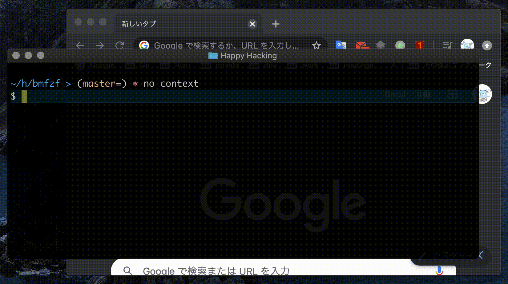

# bmfzf

 [](https://godoc.org/github.com/po3rin/bmfzf)  

bmfzf lets you fuzzy search of Chrome Bookmarks.



## Install

### Go

```bash
$ go get -u github.com/po3rin/bmfzf
```

## Usage

bmfzf cli return bookmark url.

```bash
# choose Google bookmark
$ bmfzf
https://www.google.co.jp
```

When combined with other tools, bmfzf is more useful! following command is fuzzy serch & open page in Chrome.

```bash
# MacOS example
open -a '/Applications/Google Chrome.app' $(chrbmfzf)
```

## TODO

- [ ] Provide tools with Homebrew

